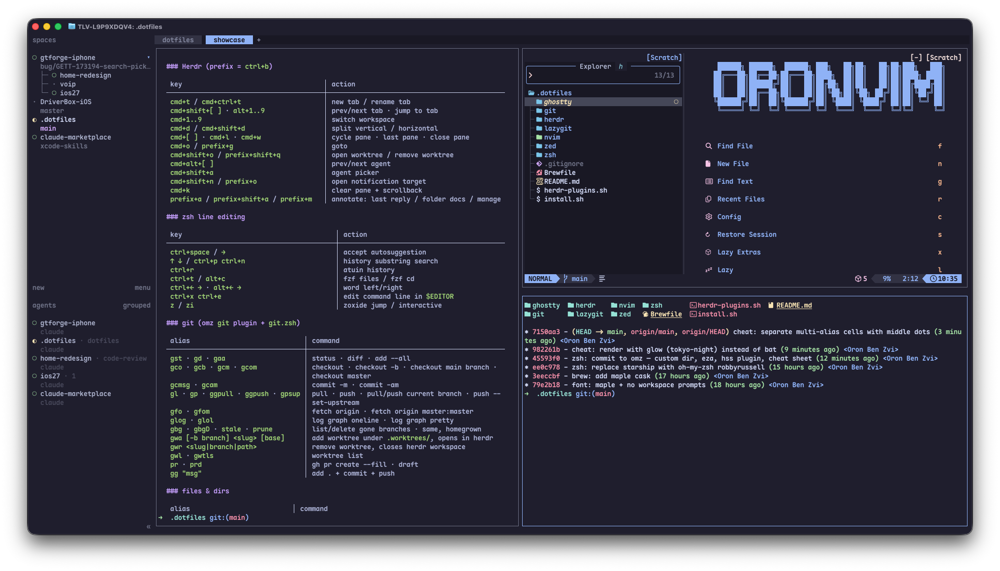

# dotfiles



macOS terminal setup. Managed with [GNU Stow](https://www.gnu.org/software/stow/): each top-level directory is a package whose layout mirrors `$HOME`, stowed as per-file symlinks (`--no-folding`).

## Stack

| | |
|---|---|
| terminal | [ghostty](https://ghostty.org) + [herdr](https://github.com/herdr) |
| shell | zsh + [oh-my-zsh](https://ohmyz.sh) — `zsh/.zshrc`; `~/.config/zsh` is `$ZSH_CUSTOM`, every `*.zsh` there auto-sourced |
| prompt | omz `robbyrussell` |
| plugins | omz: `git` · `macos` · `eza` · `history-substring-search` · brew: zsh-autosuggestions · zsh-syntax-highlighting · zsh-completions |
| tools | fzf · zoxide · eza · bat · lazygit · btop · k9s · yazi |
| editor | nvim — LazyVim (`nvim`/`lazy`) · zed |

## Install

```sh
git clone git@github.com:oronbz/dotfiles.git ~/.dotfiles
~/.dotfiles/install.sh
```

Installs Homebrew + `Brewfile`, clones oh-my-zsh, creates `~/.config/zsh/secrets.zsh` from the example (fill it in), seeds `~/.gitconfig.local` with your git identity (taken from your existing global config, else prompted), stows every package.

Existing dotfiles that would collide are moved to `~/.dotfiles-backup/<timestamp>/`, never overwritten. Merge what you still need into `~/.config/zsh/work.zsh` (shell) or `~/.gitconfig.local` (git) — both are auto-loaded and gitignored.

No version manager: node, ruby (`/opt/homebrew/opt/ruby/bin` first in PATH) and python come straight from brew. nvm/rbenv/pyenv users — re-add their init in `~/.config/zsh/work.zsh`.

`brew bundle` failures don't abort the install. Typical one: a cask whose app you already installed by hand (e.g. Ghostty) — delete the app and rerun, or leave it.

## Layout

```
zsh/        .zshrc .zprofile .config/zsh/{path,aliases,git,functions}.zsh
ghostty/    .config/ghostty/config
herdr/      .config/herdr/{config.toml,agent-picker.sh,clear-pane.sh}
git/        .gitconfig .config/git/ignore
nvim/       .config/LazyVim
lazygit/ zed/
Brewfile    brew bundle dump (taps, formulae, casks)
```

## Day to day

- Edit files in `~/.dotfiles` directly — they're symlinked, changes are live.
- New config: `mkdir -p ~/.dotfiles/<pkg>/.config/<pkg>`, move the file in, `cd ~/.dotfiles && stow --no-folding <pkg>`.
- After `brew install`: `brew bundle dump --force --file=~/.dotfiles/Brewfile`. npm/go/mas skipped via `HOMEBREW_BUNDLE_DUMP_NO_*` in `path.zsh`. Dump silently drops formulae from untrusted taps — `brew trust --tap <user/repo>` first, then they land as `trusted: true`.
- Secrets live in `~/.config/zsh/secrets.zsh`, work-machine env/functions in `~/.config/zsh/work.zsh`; auto-sourced like the rest, both gitignored, never in this repo.
- Git identity (`user.name`/`user.email`) and any other machine-local git config live in `~/.gitconfig.local`, included from `.gitconfig`. Nothing personal in the tracked `.gitconfig`.

## zsh notes

- Startup ~300ms. Profile: prepend `zmodload zsh/zprof` to `.zshrc`, run `zprof`.
- `cheat` renders the cheat sheet below with glow.
- omz owns `compinit`; dump at `~/.oh-my-zsh/cache/.zcompdump-<zsh-version>`, rebuilt when omz revision or `fpath` changes. New tool completion missing? `rm ~/.oh-my-zsh/cache/.zcompdump*`.

## Cheat sheet

### Herdr (prefix = `ctrl+b`)

| key | action |
|---|---|
| `cmd+t` / `cmd+ctrl+t` | new tab / rename tab |
| `cmd+shift+[` `]` · `alt+1..9` | prev/next tab · jump to tab |
| `cmd+1..9` | switch workspace |
| `cmd+d` / `cmd+shift+d` | split vertical / horizontal |
| `cmd+[` `]` · `cmd+l` · `cmd+w` | cycle pane · last pane · close pane |
| `cmd+o` / `prefix+g` | goto |
| `cmd+shift+o` / `prefix+shift+q` | open worktree / remove worktree |
| `cmd+alt+[` `]` | prev/next agent |
| `cmd+shift+a` | agent picker |
| `cmd+shift+n` / `prefix+o` | open notification target |
| `cmd+k` | clear pane + scrollback |
| `prefix+a` / `prefix+shift+a` / `prefix+m` | annotate: last reply / folder docs / manage |

### zsh line editing

| key | action |
|---|---|
| `ctrl+space` / `→` | accept autosuggestion |
| `↑` `↓` / `ctrl+p` `ctrl+n` | history substring search |
| `ctrl+r` | atuin history |
| `ctrl+t` / `alt+c` | fzf files / fzf cd |
| `ctrl+←` `→` · `alt+←` `→` | word left/right |
| `ctrl+x ctrl+e` | edit command line in `$EDITOR` |
| `z` / `zi` | zoxide jump / interactive |

### git (omz `git` plugin + `git.zsh`)

| alias | command |
|---|---|
| `gst` · `gd` · `gaa` | status · diff · add --all |
| `gco` · `gcb` · `gcm` · `gcom` | checkout · checkout -b · checkout main branch · checkout master |
| `gcmsg` · `gcam` | commit -m · commit -am |
| `gl` · `gp` · `ggpull` · `ggpush` · `gpsup` | pull · push · pull/push current branch · push --set-upstream |
| `gfo` · `gfom` | fetch origin · fetch origin master:master |
| `glog` · `glol` | log graph oneline · log graph pretty |
| `gbg` · `gbgD` · `stale` · `prune` | list/delete gone branches · same, homegrown |
| `gwa [-b branch] <slug> [base]` | add worktree under `.worktrees/`, opens in herdr |
| `gwr <slug\|branch\|path>` | remove worktree, closes herdr workspace |
| `gwl` · `gwtls` | worktree list |
| `pr` · `prd` | gh pr create --fill · draft |
| `gg "msg"` | add . + commit + push |

### files & dirs

| alias | command |
|---|---|
| `ls` · `la` · `ll` · `lsd` · `ldot` · `lD` | eza variants (dirs first, git, icons) |
| `f` | yazi |
| `..` · `...` · `-` · `d` · `1..9` | omz dir stack |
| `cdf` · `pfd` · `ofd` · `pfs` | cd to Finder dir · print Finder dir · open Finder here · Finder selection |

### tools & apps

| alias | command |
|---|---|
| `h` | herdr |
| `cc` · `yolo` | claude, skip permissions |
| `ct` | claude via telegram channel |
| `vi` · `vim` · `nvim` · `lazy` | LazyVim |
| `lg` · `top` · `img` | lazygit · btop · chafa preview |
| `zshc` · `szh` · `ghc` | edit .zshrc · reload · edit ghostty config |
| `code` | VS Code here |
| `bt` | restart bluetooth |

### iOS / Xcode

| fn | does |
|---|---|
| `xc` | `xed .` |
| `derived` | wipe DerivedData |
| `pi` | `bundle exec pod install` |
| `cpreviews` | delete SwiftUI preview simulators |
| `swiftpm` | rm `Rider/.swiftpm` |
| `fixschemes` | unsuppress auto-created schemes |

### misc

| fn | does |
|---|---|
| `godev` | cd to go src |
| `nvimclean` | wipe nvim state + share |
| `reset_audio` · `kill_audio` | restart CoreAudio |
| `dawdl` · `eawdl` | AWDL interface down/up |
| `cheat` | this |
